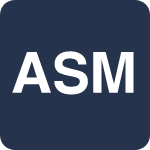
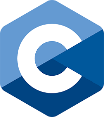

# Learn Programming
Here you can find a giant list of urls to learn a brand new programming language.

# Table of contents
- [Assembly](#assembly)
- [Bash](#bash)
- [C](#c)

# Assembly
| Name | Link | Video |
| ---- | ---- | ----- |
| Assembly in 100 seconds | https://youtube.com/watch?v=4gwYkEK0gOk | yes |
| Section.io | https://www.section.io/engineering-education/assembly-part-1/ | no |
| Hackr.io | https://hackr.io/tutorials/learn-assembly-language | no |
| Mschwartz's GitHub Assembly Tutorial | https://github.com/mschwartz/assembly-tutorial | no |
| Free Code Camp | https://www.freecodecamp.org/news/learn-assembly-language-programming-with-arm/ | no |

 

    
    
Assembly language is a low-level programming language for a computer or other programmable device specific to a particular computer architecture in contrast to most high-level programming languages, which are generally portable across multiple systems. Assembly language is converted into executable machine code by a utility program referred to as an assembler like NASM, MASM, etc.

   

# Bash
| Name | Link | Video |
| ---- | ---- | ----- |
| Ryan's Tutorials | https://ryanstutorials.net/bash-scripting-tutorial | no |
| Linux Config | https://linuxconfig.org/bash-scripting-tutorial | no |
| GNU | https://www.gnu.org/software/bash/ | no |
| Javatpoint | https://www.javatpoint.com/bash | no |
| Redhat | https://www.redhat.com/sysadmin/learn-bash-scripting | no |

 

    
    
Bash is a command processor that typically runs in a text window where the user types commands that cause actions. Bash can also read and execute commands from a file, called a shell script.

# C
| Name | Link | Video |
| ---- | ---- | ----- |
| W3Schools | https://www.w3schools.com/c | no |
| cprogramming.com | https://www.cprogramming.com/tutorial/c-tutorial.html | no |
| Javatpoint | https://www.javatpoint.com/c-programming-language-tutorial | no |
| Free Code Camp | https://www.freecodecamp.org/news/what-is-the-c-programming-language-beginner-tutorial/ | no |
| Geeks for geeks | https://www.geeksforgeeks.org/c-programming-language/ | no |

 

    
    
C is a procedural language that provides no support for objects and classes. C++ is a combination of OOP and procedural programming languages. C has 32 keywords and C++ has 63 keywords. C supports built-in data types, while C++ supports both built-in and user-defined data types.

